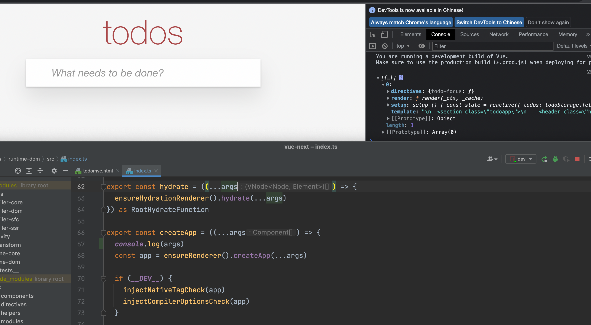

## 准备工作

1. clone[vue-next](https://github.com/vuejs/vue-next.git) 代码到本地
2. 安装pnpm `npm install -g pnpm` vue3默认使用pnpm进行依赖的管理，所以需要安装[pnpm](https://www.pnpm.cn/npmrc)
3. 运行 `pnpm install` 将项目相关的依赖下载下来，为后续的调试作准备

## 项目结构
```
.
├── packages------------------------------- 核心目录
│   ├── compiler-core
│   ├── compiler-dom
│   ├── compiler-sfc
│   ├── compiler-ssr
│   ├── reactivity
│   ├── ref-transform
│   ├── runtime-core
│   ├── runtime-dom
│   ├── runtime-test
│   ├── server-renderer
│   ├── sfc-playground
│   ├── shared
│   ├── size-check
│   ├── template-explorer
│   ├── vue
│   ├── vue-compat
│   ├── global.d.ts------------------ 全局类型声明
├── scripts-------------------------------- 打包相关
│   ├── bootstrap.js
│   ├── build.js
│   ├── dev.js
│   ├── filter-e2e.js
│   ├── filter-unit.js
│   ├── preinstall.js
│   ├── release.js
│   ├── setupJestEnv.ts
│   ├── utils.js
│   └── verifyCommit.js
├── test-dts------------------------------- 测试相关
│   ├── ...
├── CHANGELOG.md--------------------------- 更新日志文件
├── README.md------------------------------ readme
├── package.json
├── pnpm-workspace.yaml-------------------- 告诉pnpm代码路径
├── rollup.config.js----------------------- rollup配置
└── tsconfig.json-------------------------- typescript配置

```

### pnpm-workspace
Vue3采用 [monorepo](https://segmentfault.com/a/1190000039157365) 是管理项目代码的方式。在一个 repo 中管理多个package，每个 package 都有自己的类型声明、单元测试。
所以相较vue2来说，vue3的各个模块划分的更加清晰，读起来也更加容易。

通过`pnpm-workspace.yaml` 将包模块代码放置在了packages的文件夹下（install的时候会去讲packages目录下的依赖也安装下来）。


## 本地调试
接下来我们看到`package.json`中存在`dev`选项，可以本地运行起来。
运行完之后就能看到
```
created packages/vue/dist/vue.global.js in 1.2s
```
也就是说，本地的`vue.js`已经创建完成，在`vue/dist`目录下。

vue准备了几个`example`，我们可以直接用来测试。我们挑一个打开
```
/vue/examples/composition/todomvc.html

<script src="../../dist/vue.global.js"></script>
<link rel="stylesheet" href="../../../../node_modules/todomvc-app-css/index.css">

....
```
可以看到在todomvc中引入的是当前`vue/dist/vue.global.js`, 也就是我们`run dev`生成的代码。 
所以我们可以直接在浏览器中进行调试。我们尝试一下在`packages/runtime-dom/src/index.ts`中找到createApp方法，直接打印args参数。
我们在浏览器中打开，可以看到


通过这样调试，我们可以在阅读源码有疑问的时候进行打印，非常的方便。
